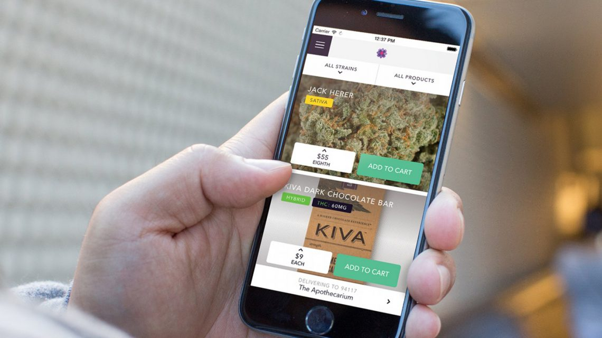

It has been almost 80 years that marijuana has been illegal on a federal level. The tactics used to make a plant that literally helped our nation grow to be the great nation that is we're heinously pushed through congress, to say the least. Based on ignorance, bigotry and outright racism, the plant that was a required crop for farmers when we were a fledgling country was made illegal with fear-Monterey stigmas. Backed by the oil and paper industries, the laws that undone have brought nothing but hardship to the working class and needlessly filled our for-profit prisons with nonviolent "drug offenders". In recent years, even individuals that don't smoke have come to the realization that the law is unjust in this case. And as a result, a great thing is happening, albeit slowly for some states, as the nation revises its many unjust marijuana laws. There are 25 states that have realized it is time and has taken to legalize the world's most beneficial plant in some complicity or another. It's really only a matter of time before the rest of them follow suit.

## As a result of this newfound legal status, many app builders are jumping on the weed train at astonishing rates.

From useful marijuana apps to help you identify what you just bought, to maps for finding a great dispensary, there is nothing a cannabis app developer can't come up with. They have even found a way to turn your phone into a scale!  Instead of leaving you to flounder, searching google for the best apps out there, we have compiled a comprehensive list of the most useful apps to date. I'm going to hook you up with dating apps to stave off loneliness, weed maps so you never get lost, and games to waste your time while you sit on your couch stoned out of your mind.  While you can pay for premium versions to get rid of ads in a few of them, almost all of them are free apps, while a couple of them do require payment to use the services available to them, and the games also offer in-app purchases, so it's a good idea to keep that in mind. So enough talking, let's get to it.   

## Cannabis Dating Apps and Social Networks for Ganja Lovers

 The kind land - O cokehead and other dating apps for dopers[/caption] In this day and age, there are so many apps for the dating community that it's hard for even the most average joe to find the person they are meant to be with. We all know how hard it is to find like-minded people in this world. If you smoke or consume marijuana, whether it's for medicinal purposes or whether it's for recreation, it makes it even harder to find people to date. These marijuana apps help to take a little of the guesswork out of it and help you to hook up with a Mary Jane that likes Mary Jane.

### High There -

 This little gem is like the Facebook of weed. It connects you to other pot lovers with pictures and videos, I'd compare it closely to many other social networking platforms. Except this social network connects you to other people who also like to toke. You don't have to worry about offending a non-smoking user because on here, all the users smoke weed!

### 420 Singles -

This one only has 10,000 downloads on the Android market but it is specifically intended for the dating scene. The biggest complaint in the reviews is the lack of people that are in a person's area. But c'mon, what do you expect? The only way that will change is if you give it a chance and download it yourself. Try it out and see if there is anyone local.

### My 420 Mate -

My 420 Mate - The cupid of the marijuana world[/caption] This waste of space offers a much less user-friendly though the website does look shiny. First, I couldn't find a way to register with the app, I had to get online and do it. Then once I had done so, the UI is just ridiculously unfriendly. They need to do some major improvements before they will ever get above that 10,000 download mark. User reviews have left it an overall rating of 1.9 which is pretty bad considering that stoners are likely some of the most forgiving people on the planet.

### Leafly -

Leafly - We approve this one![/caption] This app is probably the best available on the market as far as networking and connecting with other stoners. Not only can you network, it offers a comprehensive combination of social networking, cultural information, dispensary location, strain reviews, and you can also view pictures and videos other users upload. This app has brought it all together in one convenient location - your pocket.

### Mass Roots -

Mass Roots - Homepage[/caption] This one won my attention and gets actually gets me to endorse it as pretty awesome. It is like the Instagram of weed apps. You can connect and follow growers, glass artists, dispensaries and fellow enthusiasts. Discover trending strains, get updates on new products, shop for deals and find discounts to your local dispensaries. This is really another one of those one stop apps. I'd compare it to the Instagram of the marijuana community. With a 4.4 rating in the android market, you can't go wrong on this one. Also available on iOS

## Strain Identifiers and Photo Sharing Marijuana Apps

Whether you just turned 18 and want to step into a whole new world or even if you are a seasoned smoker that has more often been referred to as that one hippie friend that everyone has, you know there will come a time when someone hands you a bud and you just stare at it in awe with no idea what strain it is, whether it's a Sativa bud or an indicia strain. Or maybe you and your dealer are having a deep, emotional argument about what kind of herb they are trying to sell you. Have you ever walked into a room and had someone offer a beautiful bud and swears its Sour Diesel? Sure you have. Have you ever looked at that bud and knew that while you had no idea what it actually was, you knew it wasn't Sour Diesel? These apps are the perfect companion for you to identify that unknown beauty you are about to roll up and smoke. You'll never have to take your dealers word for it again. Check them out.

### PotSnob -

Pot Snob - All the strains you never even needed. All the time.[/caption] This only goal of this app is to develop your noobie doobie lovin' butt into a refined and classy marijuana smoking authority. It offers a grid view of every strain you could ever want to know about, and even a few you have probably never heard of. You just click on a picture of one of the beautiful buds and you will get strain information, THC content and more. This app wants to turn us all into Mary Jane connoisseur. Available on both Android and iOS

### Duby -

Pass the Duby[/caption] This one is hard to classify. I'd almost compare it to being like the Tinder of marijuana. You can upload pictures and videos, follow other users, and instead of others sharing your content, they pass your Duby on to their followers. It even offers a pretty slick chat interface so you can safely talk to other users.

###  Weed Dictionary -

Weed Dictionary - Every word you need.[/caption] This is exactly what it sounds like. The Webster Dictionary hasn't got squat on the Weed Dictionary. They have brought together expert terminology on all aspects of weed. It has a simple to use UI and more than 500,000 downloads. It is a great guide for beginners who don't know what they are talking about.

## Maps for Finding Medical Dispensaries and Recreational Head Shops

Picture it. Maybe you're on a road trip and you're passing through a state where bud is legal, how will you know where to find the best dispensaries? Or maybe you have just moved and you are looking to get into the scene. If you don't want to just walk up and down the street stepping into every random head shop you come across, give these apps a glance and see which ones will help you find the best dispensaries, deals, and deliveries near your location. All in the palm of your hand.

### WeedMaps -

 WeedMaps.com - The google maps of weed[/caption] This an awesome cannabis app to find dispensaries. It uses the location services on your phone to help you find local deals, reviews and it displays it all on your screen just like Google maps. When you click on a dispensary tab, you will be able to see if they offer delivery services and everything. You can filter results so you can find exactly the place you are looking for. This is one of the original marijuana apps in the market.

### Weedfinder -

Weed Finder - Enough said...[/caption] With this app you can not only find local dispensaries, you'll also have the ability to map them out, find local businesses, shop deals, peruse classified ads, find marijuana gear check out the latest news, watch Weedfinder tv and set your favorites all from one screen. Available for the Android and iOS

## Scientific and Medical Help

 Buying Marijuana on Meadow[/caption] Medical marijuana is the leader in cutting edge in a patient comfort. Treating a wide array of illnesses, from physical aches and pains that come with living life, to dietary stimulation for patients that are receiving cancer treatments. The miracle of marijuana is becoming a much-needed relief for people everywhere but there is still a long way to go before you will find readily available information on every store shelf. Until those days come to pass, these apps will allow you to find scientific information and even medical help for you and you won't even have to get up out of bed if you can't, or even if you just don't want to.

### EazeMD -

EAZE - Marijuana Delivery made easy.[/caption] Have you ever wanted to download an app that you could just open up and face-time with a doctor? Well, now you can. Eaze MD literally connects you face to face with a doctor that will run an evaluation on you and then send you a physical copy of their recommendation to you. While the app is free, the consultation will cost you $30 but that is money well spent considering you never have to leave your home. Available for Android and iOS

### My Canary -

 Canary - Prohibition is over![/caption] If you want to have a marijuana app that tracks your personal performance, (I.e accurately measure your impairment) Canary is the first app to provide the needed scientific information that will allow you to accurately evaluate it privately, anytime, anywhere. This marijuana app gets the seal of approval from the awareness group NormL. You have to trust an app when it is the ONLY app that has received an endorsement from the one group that has spent more than 45 years putting forth effort in a national movement of legalization. This weed app does cost 4.99 to download but your payment helps to further the fighters of the cause continue on the path to legalization.

### Weed Scale 4.20

 Aexol - Weed Scale 4.20[/caption] The developers over at Aexol have brought you a unique marijuana app that is exclusive to the android market. Apple seems to be a bit wary of allowing an app that weighs our weed to their market, which is why it only available in the Play Market because android doesn't suffer from such an affliction. The description simply defines it as the first real, working digital scale simulator. I have to say, I was skeptical as hell on this one, but I downloaded and was absolutely blown away. You do have to have a nickel handy for the calibration but after that is all done, it works extremely well for small quantities of bud. It does have a lot of intrusive ads but with a million downloads and raving reviews, all I can say is give it a try and find out for yourself how well it works. Is there really anything our smartphones can't do these days? Android exclusive.

### Grow Buddy -

 Grow Buddy - All you need to grow fine buds[/caption] With states that have medical marijuana that is now allowing patients to grow their own medicine at home, this cannabis app is the perfect answer to keeping you from killing your crop. It is a companion app to the more powerful desktop version but it records data such as feeding schedules, water schedules, and the likes. It can work for a single plant or, if you need a lot of medicine, it will work for multiple plants as well. Great for the gardeners with a brown thumb like mine. Available for Android only.

### Green Rush -

Green Rush - Cannabis Delivered[/caption] This is a delivery service app that could easily be compared to Grubhub (The popular food app). You order your marijuana-infused edibles and they bring those tasty munchies right to your door. They offer quick delivery but you do have to bear in mind that they are entirely codependent on which dispensaries choose to participate in the service. They also deliver bud, wax, joints all sorts of great things so it's great for patients who just can't get out and about to get to the nearest weed shops. Available for Android and iOS.

## Game apps that Revolve Around Weed

The average American spends around four and a half hours on their phones, mostly using apps. That doesn't take into account the amount of time spent messing around with our tablets and computers. The average stoner probably sits on their couch baked for around the same amount of time. Instead of just sitting there staring at the walls while you toke it up, why not spend a little bit of it wasting time in the least productive way while you stare at your phone? They may waste space but they will definite help pass the time. This weed themed marijuana app games should help you do just that. But don't take my word for it, check them out for yourself and see how you like them.

### Ganja Farmer -

 Ganga Farmer - Run your own weed farm. If you're not living in a state that has legalized yet, Ganja Farm can help you prepare for the day when your state finally does legalize it. You get open and operate your own marijuana dispensary. You start small and begins earning big revenue quick. Use your money to upgrade your storefront and customize your shop. Buy weed from others, or go gangsta and steal your pot from others. You can even hire thugs to make it harder on the competitions rise to success.

### Weed Garden -

Weed Shop Games - Weed Garden gameplay screenshot[/caption] If you have ever spent hours of your time on FarmVille, you will LOVE this game. It is exactly the same concept except, well, except it's for farming weed! Plant your seeds and watch them grown. This is probably the most visually realistic game I have tried so far. It has 3D environments and the plants are grown outdoors. Available in the Play market.

### WeedFirm -

 Manitoba Games - Weed Firm Replanted.[/caption] Replanted - Another game where you grow weed and build a bustling business out of it. Outsmart the cops with bribes, grow your plants and sell your bud till you have a successful business even the gangsters would be jealous of. Available on the Android and iOS platforms.

### Weed Shop -

Weed Shop Game - Open up your weed shop..[/caption] Offering a prolific gaming environment, you will operate your own medical marijuana dispensary in this great time wasting marijuana app. You have a huge variety to choose from to grow and sell, you'll serve weed to real virtual patients, make real virtual cash that you can invest in improvements to your shop until you are making hash and dabs that you can virtually smoke to make sure your dispensary only carries the highest quality products.

### Weed Bakery -

Weed Bakery The Game[/caption] If you like games that revolve around cooking instead of growing this game is for you. You open your own edible marijuana baker and weed shop in Colorado. Some of the reviews complained that it's glitchy but you can please all of the people some of the time and some of the people all of the time, right?

## The results are in!

It's not hard to find a plethora of information on the Internet nowadays, websites dedicated to buying and selling pot. Blogs that give you all the information you could ever want about our girl Mary Jane. Just plug in a Google search and it's all right there at your fingertips or takes a look around at our other articles. The thing is, We have already spent hours researching, downloading and testing all these marijuana apps that fit right into your phone. There is no need to run another Google search for information about ganja. Just give this list a glance every time you need the information and I promise you that these apps are all powerful tools to help you find just what you are looking for. No matter what the goal, you now have a comprehensive list of apps that gives you a way to become probably the most productive stoner the world has ever seen. You'll never be lost, you'll never forget which flower gives you the best high, and you'll never have to eat again without getting an amazing head change out of the deal.
