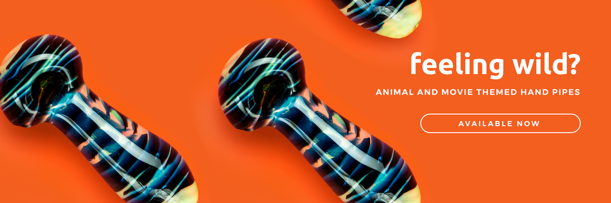

## Dankstop comes from a humble start.

Started by two young stoner entrepreneurs Dankstop Headshop offers a pretty sick selection of **stoner gear, glass hand pipes, herb grinders, bongs, bubblers, recyclers, dab rigs, ash catchers, rolling papers, and dab nails**. Dankstop knows that not everyone has wants the same smoking gear and so they hand select the best quality smoking gear they can get their hands on, from hand blown custom glass pieces, to everyday brands. They also stock cheaper items and more expensive pieces for those times you want to splash out! The Dankstop online store is really well designed with a cool slider to check by price. You can also browse by brand.

## From underdog to top shelf.

The vision behind the young startup was to become a reliable headshop and they have achieved just that. When they started Dankstop they were sick of there local headshops charging a fortune for cool pieces and run by sketchy business owners. Set out to prove a point that headshops can provide good value, quality fast shipping and excellent support. After a good few years running now they have proven there point and stand tall among the giants.

## They have an awesome blog and dank ish!

Dankstop has a pretty sweet blog that we often peruse. The style of writing and cool vibes feel personal and familiar and every known again they will have a sick dank giveaway!

## Ok, Dankstop is Dank!

Low overheads and 24 hour support keep Dankstop in our top 3 retailers. They have a money back guarantee, free shipping and many other percs.
